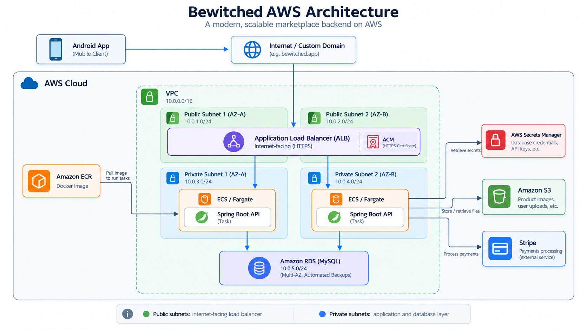

# Bewitched Marketplace

**Full-stack e-commerce marketplace developed with Spring Boot, Kotlin, MySQL, Docker and AWS.**

Bewitched is a complete marketplace application composed of a native Android client and a REST API backend.

The project includes user authentication, product management, shopping cart, order processing, payments, administration, database migrations, cloud storage and deployment on AWS.

> The complete source code is maintained in a private repository.  
> This public repository is intended as a technical portfolio and project showcase.

---

## Overview

Bewitched was designed as a complete marketplace platform with two main components:

- **Android application** developed with Kotlin
- **Backend REST API** developed with Java and Spring Boot

The application communicates with external services such as Stripe and AWS and uses MySQL for persistent data storage.

---

## Main Features

### User Features

- User registration and login
- JWT authentication
- Email confirmation
- Product catalog
- Product categories
- Product detail pages
- Shopping cart
- Order management
- Stripe payments
- User profile management
- Password recovery

### Administration

- ADMIN / USER roles
- Product management
- User management
- Order management
- Administrative endpoints
- Account blocking and security controls

---

## Technology Stack

### Backend

- Java 21
- Spring Boot
- Spring Security
- Spring Data JPA
- Hibernate
- JWT
- REST APIs
- Maven
- Flyway

### Android

- Kotlin
- Android SDK
- Retrofit
- Glide
- Material Design

### Database

- MySQL
- Amazon RDS
- Flyway migrations

### Payments

- Stripe API
- Stripe Checkout
- Stripe Webhooks

### Cloud & DevOps

- Docker
- Amazon ECR
- Amazon ECS
- AWS Fargate
- Amazon RDS
- Amazon S3
- Application Load Balancer
- AWS Certificate Manager
- AWS Secrets Manager
- Amazon VPC
- Security Groups

### Development Tools

- Git
- GitHub
- IntelliJ IDEA
- Android Studio
- Visual Studio Code
- Postman

---

## Architecture



The backend is packaged as a Docker image and stored in **Amazon ECR**.

Amazon ECS with **AWS Fargate** runs the application without requiring direct management of EC2 servers.

The database is hosted in **Amazon RDS** and protected inside the application's VPC.

---


## Security

The project implements several security mechanisms:

- Spring Security
- JWT authentication
- Role-based authorization
- Protected ADMIN endpoints
- Login attempt limits
- Temporary account blocking
- Environment-based secret management
- AWS Secrets Manager
- HTTPS certificates with AWS Certificate Manager
- Security Groups
- Private database networking

Sensitive credentials are never stored directly in the source code.

Example:

```properties
spring.datasource.password=${DB_PASSWORD}
app.jwt.secret=${JWT_SECRET}
stripe.secret.key=${STRIPE_SECRET_KEY}
```

---

## Database Versioning

Database migrations are managed with **Flyway**.

Each database modification is stored as a versioned SQL migration.

Example:

```text
V1__initial_schema.sql
V2__add_orders.sql
V3__update_users.sql
V4__update_payments.sql
```

This allows the database schema and application code to evolve together.

---

## Screenshots

<table>
  <tr>
    <td align="center">
      <br>
      <b>Login</b>
    </td>
    <td align="center">
      <br>
      <b>Home</b>
    </td>
    <td align="center">
      <br>
      <b>Product Catalog</b>
    </td>
  </tr>
  <tr>
    <td align="center">
      <br>
      <b>Product Detail</b>
    </td>
    <td align="center">
      <br>
      <b>Shopping Cart</b>
    </td>
    <td align="center">
      <br>
      <b>User Profile</b>
    </td>
  </tr>
  <tr>
    <td align="center">
      <br>
      <b>Administration</b>
    </td>
  </tr>
</table>

---

## Project Structure

The private development repository is organized into two main applications:

```text
MarketplaceBewitched/
│
├── android/
│   └── Native Android application
│
└── backend/
    └── Spring Boot REST API
```

---

## Development Workflow

A typical backend deployment follows this process:

```text
Development
    │
    ▼
Git
    │
    ▼
Docker Build
    │
    ▼
Amazon ECR
    │
    ▼
Amazon ECS / Fargate
    │
    ▼
Spring Boot starts
    │
    ▼
Flyway migrations
    │
    ▼
Application available
```

---

## Selected Code Examples

A small selection of source code is included to demonstrate key implementation areas while keeping the complete application private.

### Backend

- [REST Product Controller](examples/backend/ProductoControllerExample.java)
- [Spring Security Configuration](examples/backend/ConfiguracionSeguridadExample.java)
- [Flyway Migration](examples/backend/FlywayMigrationExample.sql)

### Android

- [Retrofit Product API Service](examples/android/ProductoApiServiceExample.kt)

> These are selected examples extracted from the private Bewitched codebase and included for portfolio purposes.

---

## Source Code

The complete application source code is maintained in a **private repository**.

This public portfolio contains selected implementation examples, screenshots and technical documentation to demonstrate the architecture and technologies used without publishing the complete application.

---

## Project Status

**Active Development**

Bewitched started as a full-stack marketplace project and has progressively evolved to include:

- Cloud deployment
- Docker containerization
- AWS infrastructure
- Database versioning with Flyway
- Stripe payment processing
- Security improvements
- Production-oriented configuration
- Android client development
- REST API integration

---

## Author

**Kevin Egoavil Barrionuevo**

Junior Java Backend / Android Developer

**Main Technologies:** Java · Spring Boot · Kotlin · Android · SQL · Docker · AWS